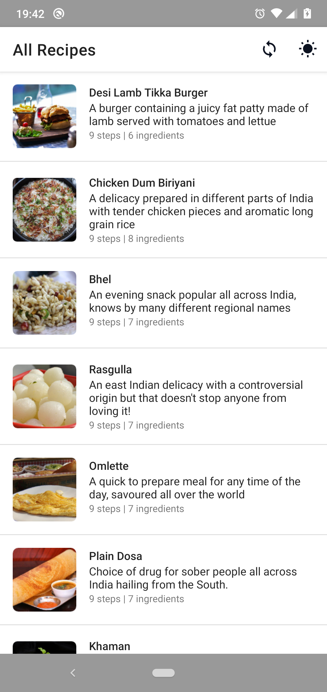
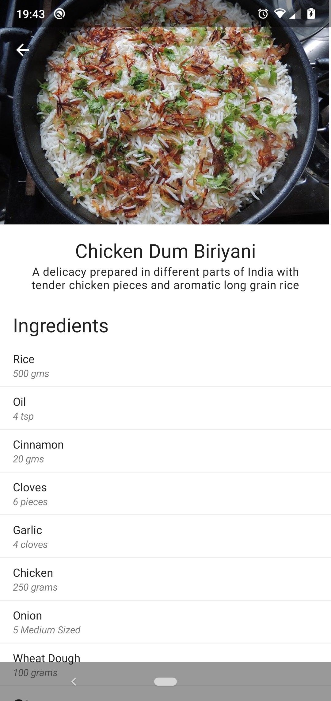
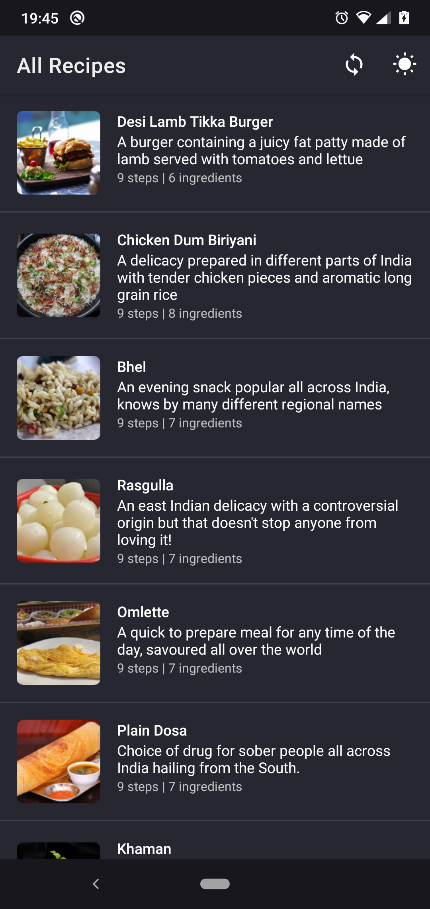
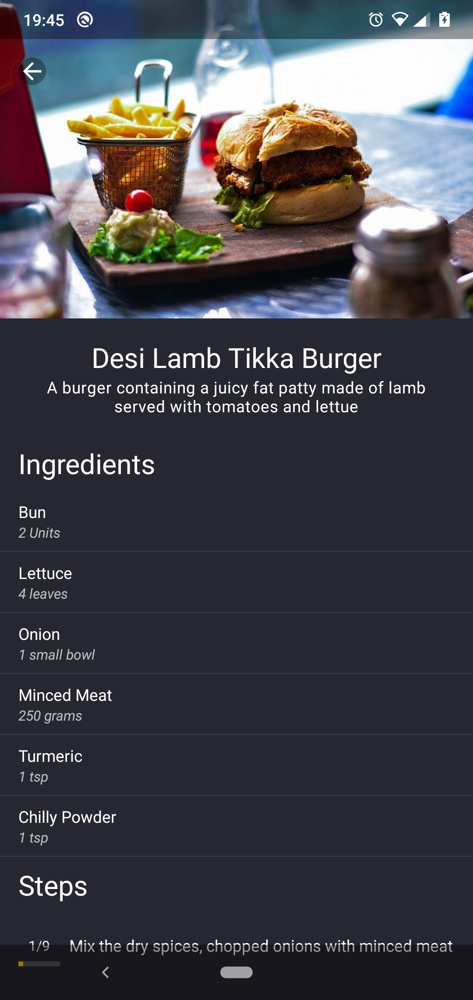

<p align="center">

</p>

<p align="center">
  <a href="https://img.shields.io/badge/License-MIT-yellow.svg"></a>
  <a href="https://badges.frapsoft.com/os/v2/open-source.svg?v=103"></a>
</p>

# Desipe 🥘
Desipe is a simple app listing a few Indian recipes, created to demonstrate some of the commonly used libraries in Android development.

## Download 📥
The release APK can be downloaded from [here](https://github.com/Pinaki93/Desipe/tree/master/apk).

## Architecture 🏗️
I've used Google [recommended app architecture](https://developer.android.com/jetpack/guide) following `Model-View-ViewModel` (MVVM) architecture, exposing `PresentationModel` out from the `ViewModel` wrapped in `LiveData` to updated the UI in a lifecycle aware manner. 

## Libraries Used 📚
UI:\
🚀 [AndroidX libraries (Core/AppCompat/ConstraintLayout/RecyclerView)](https://android.googlesource.com/platform/frameworks/support/+/androidx-master-dev)\
🚀 [Material Design](https://material.io/develop/android)\
\
Transitions:\
🚀 [Jetpack Navigation](https://developer.android.com/guide/navigation/)\
\
Threading:\
🚀 [Kotlin Coroutine](https://github.com/Kotlin/kotlinx.coroutines)\

Service Locator:\
🚀 [Koin](https://github.com/InsertKoinIO/koin)\
\
SQLite:\
🚀 [Room Database](https://developer.android.com/topic/libraries/architecture/room?gclid=Cj0KCQjwo6D4BRDgARIsAA6uN187m5Vp-GP0Vg9HLx4JpN3CHfDGedLVNVTF0uxZd4d6N2gzAxVLfVkaAuqxEALw_wcB&gclsrc=aw.ds)\
\
Image loading/animations:\
🚀 [Coil-Kt](https://github.com/coil-kt/coil)\
🚀 [Lottie](https://github.com/airbnb/lottie-android)\
\
HTTP Operations:\
🚀 [Retrofit](https://github.com/square/retrofit)\
🚀 [Okhttp](https://github.com/square/okhttp)\
\
JSON serialization/deserialization:\
🚀 [Moshi](https://github.com/square/moshi)\
\
Mocking/Spying test objects:\
🚀 [Mockk](https://mockk.io/)

## Data ☁️
Data is a dummy set of JSON and images hosted on a github page. Most of the content is still dummy. Please feel free to clone [this repo](https://github.com/Pinaki93/json-data) and add/modify content under the `recipes` folder.

# Dark Theme 🌙
Support for Dark Theme is available. However, there is a small bug for Android 10 and above that the theme doesn't get updated when user selects **Follow System** from the bottom sheet. Upon killing the app once and returning back, the theme gets updated.

## Screenshots 📷
<h4>Light Theme:</h4>


<h4>Dark Theme:</h4>




## License
```
MIT License

Copyright (c) 2020 Pinaki Acharya

Permission is hereby granted, free of charge, to any person obtaining a copy
of this software and associated documentation files (the "Software"), to deal
in the Software without restriction, including without limitation the rights
to use, copy, modify, merge, publish, distribute, sublicense, and/or sell
copies of the Software, and to permit persons to whom the Software is
furnished to do so, subject to the following conditions:

The above copyright notice and this permission notice shall be included in all
copies or substantial portions of the Software.

THE SOFTWARE IS PROVIDED "AS IS", WITHOUT WARRANTY OF ANY KIND, EXPRESS OR
IMPLIED, INCLUDING BUT NOT LIMITED TO THE WARRANTIES OF MERCHANTABILITY,
FITNESS FOR A PARTICULAR PURPOSE AND NONINFRINGEMENT. IN NO EVENT SHALL THE
AUTHORS OR COPYRIGHT HOLDERS BE LIABLE FOR ANY CLAIM, DAMAGES OR OTHER
LIABILITY, WHETHER IN AN ACTION OF CONTRACT, TORT OR OTHERWISE, ARISING FROM,
OUT OF OR IN CONNECTION WITH THE SOFTWARE OR THE USE OR OTHER DEALINGS IN THE
SOFTWARE.
```
